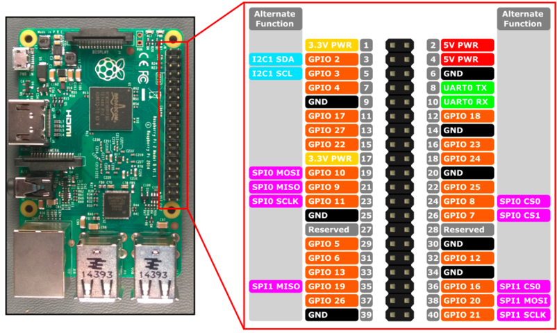

# dagens-eko-player

A daily news radio player. Using a raspberry pi as hardware and the Swedish Radio as news source.

## prerequisites

### software set up

This project uses vlc as a media player, so you need to be able to run vlc from command line to make this project work as expected.

### hardware set up

The pi is expected to have a button connected to gpio(general purpose input-output) 3 and a speaker via the 3.5 mm input.
So suggestion is to connect the button to pin 5 and 6.

### script start up

I suggest to start the script on system start up. Preferably with a `cronjob`. Read more about the scripts in the [scripts readme](./scripts/README.md).

## development

First of all you need to figure out what `ip` address the raspberry pi connects to. The easiest way is probably to plug it in to a display and a keyboard and connect to your preferred network.

After that you can run `ifconfig` to figure out it's current ip. This ip may change over time, so make sure to configure your
home network/router to give your raspberry pi's `mac address` a static ip.

> ifconfig

To deploy the code to the raspberry i prefer SFTP and using Filezilla as a client.
And to start the application you have to ssh into it.

> ssh pi@{the ip}

## how to run

> yarn run main

Commands from a single button connected to the pi's GPIO or a regular keyboard are supported.

### with keyboard as input

_Supported keyboard buttons are:_

- `1` Start radio
- `2` Toggle pause
- `3` Next program
- `4` Fast forward 15 seconds
- `5` Rewind 15 seconds
- `6` Stop
- `s` Equals pressed in single button mode (see description for pi below)
- `w` Equals releases in single button mode (see description for pi below)

### on a raspberry pi with a GPIO button as input

The pi is designed to be in a box. When the box lid is opened (the button is released) the pi should start playing.

The one button solution can recognize and handle the following patterns:

- `released` will start playing
- `pressed` stop playing
- `single tap` toggle pause
- `double tap` next program
- `triple tap` fast forward 15 seconds
- `quadruple tap` rewind 15 seconds
